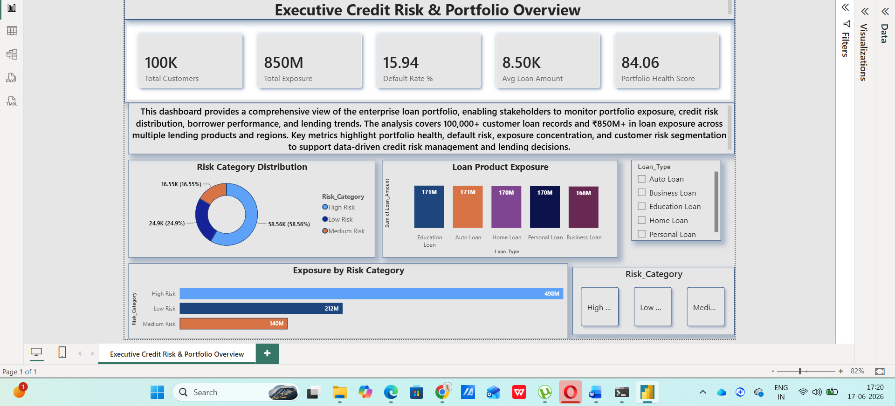
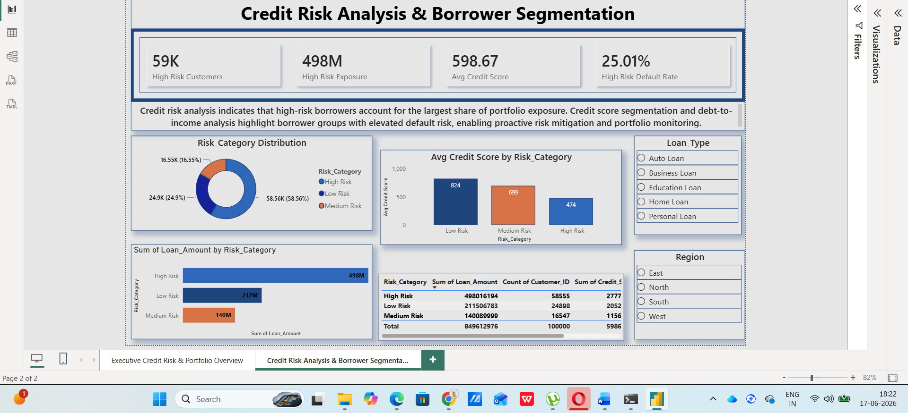

# Enterprise Credit Risk & Loan Portfolio Intelligence Platform

> An end-to-end Banking Risk Analytics solution built using Python, SQL, and Power BI to monitor portfolio performance, assess credit risk exposure, identify high-risk borrower segments, and support executive-level lending decisions through interactive business intelligence dashboards.

---

## Executive Summary

Financial institutions manage large and complex loan portfolios across multiple products, customer segments, and geographic regions. As portfolio size increases, monitoring exposure, borrower risk, delinquency trends, and portfolio health becomes increasingly challenging.

This project delivers an Enterprise Credit Risk & Loan Portfolio Intelligence Platform that transforms raw loan portfolio data into actionable business intelligence through a modern analytics workflow involving:

- Python Data Processing
- SQL Risk Analytics
- Power BI Executive Reporting
- Credit Risk Intelligence
- Portfolio Performance Monitoring

The platform enables stakeholders to proactively identify risk concentrations, monitor portfolio health, evaluate borrower segments, and support data-driven lending strategies.

---

# Business Problem

Banks and financial institutions face several portfolio management challenges:

- Limited visibility into portfolio risk exposure
- Difficulty identifying high-risk borrower segments
- Increasing delinquency and default trends
- Lack of centralized executive reporting
- Inefficient monitoring of regional concentration risk
- Delayed identification of emerging credit risks

Without a robust analytics framework, these challenges can result in increased credit losses and suboptimal lending decisions.

---

# Business Objectives

### Portfolio Management

- Monitor overall portfolio performance
- Track exposure across lending products
- Evaluate portfolio health indicators

### Credit Risk Monitoring

- Identify high-risk borrower segments
- Analyze risk category distribution
- Monitor delinquency and default trends

### Regional Risk Assessment

- Evaluate exposure concentration across regions
- Detect geographic risk hotspots
- Support portfolio diversification strategies

### Executive Reporting

- Centralize risk and performance KPIs
- Improve decision-making efficiency
- Enable data-driven lending strategies

---

# Solution Architecture

```text
Loan Portfolio Dataset
          │
          ▼
Python Data Processing
(Data Cleaning & Validation)
          │
          ▼
SQL Risk Analytics Layer
(KPI Generation & Segmentation)
          │
          ▼
Power BI Data Modeling
(DAX & Relationships)
          │
          ▼
Executive Risk Intelligence Dashboards
          │
          ▼
Business Decision Support
```

---

# Technology Stack

| Layer | Technology |
|---------|------------|
| Data Processing | Python |
| Data Analysis | SQL |
| Business Intelligence | Power BI |
| KPI Development | DAX |
| Data Modeling | Star Schema |
| Domain | Banking Analytics |
| Focus Area | Credit Risk & Portfolio Intelligence |

---

# Dataset Overview

The dataset simulates enterprise lending operations and contains:

- 100,000+ Customer Records
- Multiple Loan Products
- Credit Scores
- Borrower Demographics
- Regional Information
- Risk Categories
- Default Indicators
- Loan Exposure Metrics

---

# Dashboard Showcase

## Executive Credit Risk & Portfolio Overview



### Dashboard Purpose

Provides a centralized executive view of loan portfolio performance, portfolio health, risk exposure, and lending trends.

### Key KPIs

| KPI | Value |
|------|--------|
| Total Customers | 100K |
| Total Exposure | ₹850M |
| Default Rate | 15.94% |
| Average Loan Amount | ₹8.50K |
| Portfolio Health Score | 84.06 |

### Key Insights

- High-risk borrowers account for the largest share of portfolio exposure.
- Portfolio exposure exceeds ₹850M across multiple lending products.
- Portfolio health score indicates overall portfolio stability.
- Risk distribution analysis enables proactive credit monitoring.

---

## Credit Risk Analysis & Borrower Segmentation



### Dashboard Purpose

Identifies borrower segments contributing most significantly to credit risk and default exposure.

### Key KPIs

| KPI | Value |
|------|--------|
| High-Risk Customers | 58K+ |
| High-Risk Exposure | ₹498M |
| Average Credit Score | 598 |
| High-Risk Default Rate | 25.01% |

### Key Insights

- High-risk borrowers contribute the majority of exposure.
- Credit score distribution strongly correlates with default behavior.
- Risk segmentation highlights areas requiring enhanced monitoring.
- Borrower profiling supports targeted risk mitigation initiatives.

---

## Regional Risk Intelligence & Exposure Monitoring


### Dashboard Purpose

Analyzes geographic exposure concentration and regional lending performance.

### Key KPIs

| KPI | Value |
|------|--------|
| Regions Covered | 4 |
| Highest Regional Exposure | ₹213M |
| Average Regional Default Rate | 15.94% |
| Concentration Risk | 25.11% |

### Key Insights

- Portfolio exposure is distributed across four major regions.
- Regional concentration monitoring supports diversification strategies.
- Geographic risk analysis improves portfolio resilience.
- Default trends vary across lending markets.

---

# Python Data Engineering

Python was utilized to prepare analytical datasets and improve data quality prior to reporting.

### Key Activities

- Data Cleaning
- Missing Value Handling
- Feature Engineering
- Data Validation
- Risk Categorization
- Business Rule Implementation

### Libraries Used

```python
pandas
numpy
```

### Deliverables

- Cleaned Loan Dataset
- Risk Classification Features
- Reporting-Ready Data Model

---

# SQL Analytics Framework

SQL was used to generate business-critical metrics and analytical outputs.

### Portfolio Analytics

- Portfolio Exposure Calculation
- Loan Performance Monitoring
- Customer Segmentation

### Credit Risk Analytics

- Risk Classification
- Exposure Analysis
- Default Monitoring

### Delinquency Analysis

- Risk Trend Monitoring
- Borrower Performance Analysis
- Credit Risk Reporting

### Advanced SQL Concepts

- Joins
- Aggregations
- CASE Statements
- CTEs
- Window Functions
- Ranking Logic
- KPI Calculations

---

# Business Insights Generated

The analysis identified several important risk patterns:

### Portfolio Risk Insights

- High-risk borrowers contribute approximately 59% of total portfolio exposure.
- Exposure concentration remains highest within the high-risk segment.
- Portfolio health indicators suggest opportunities for proactive intervention.

### Credit Risk Insights

- Credit score deterioration is associated with increasing default rates.
- Borrower segmentation improves identification of vulnerable customer groups.
- Risk categories provide clear visibility into portfolio quality.

### Regional Risk Insights

- Exposure distribution varies across geographic regions.
- Concentration risk monitoring highlights potential portfolio vulnerabilities.
- Regional default patterns support targeted risk management strategies.

---

# Executive Recommendations

Based on the analysis, the following actions are recommended:

### Risk Management

- Increase monitoring frequency for high-risk borrowers.
- Implement automated early-warning risk indicators.
- Enhance borrower review processes for elevated-risk segments.

### Portfolio Optimization

- Diversify exposure across regions and lending products.
- Reduce concentration within high-risk borrower groups.
- Strengthen portfolio review frameworks.

### Lending Strategy

- Improve credit screening for high-default segments.
- Incorporate risk intelligence into lending decisions.
- Develop proactive intervention programs for delinquent accounts.

---

# Business Impact

This platform enables organizations to:

✅ Improve visibility into portfolio health

✅ Monitor credit risk exposure effectively

✅ Detect emerging delinquency trends

✅ Support proactive risk management

✅ Strengthen executive reporting capabilities

✅ Enable data-driven lending decisions

✅ Improve portfolio monitoring efficiency

---

# Skills Demonstrated

## Data Analytics

- Exploratory Data Analysis
- KPI Development
- Data Storytelling
- Business Intelligence

## SQL

- Advanced Querying
- Data Transformation
- Risk Analytics
- Performance Reporting

## Python

- Data Cleaning
- Data Validation
- Feature Engineering
- Data Processing

## Power BI

- Dashboard Development
- DAX Measures
- Data Modeling
- Executive Reporting

## Banking Analytics

- Credit Risk Analytics
- Loan Portfolio Monitoring
- Delinquency Analysis
- Risk Segmentation
- Exposure Monitoring

---

# Repository Structure

```text
Enterprise-Credit-Risk-Loan-Portfolio-Intelligence-Platform
│
├── README.md
│
├── Dashboard
│   └── Enterprise_Credit_Risk_Dashboard.pbix
│
├── SQL
│   ├── Risk_Analysis.sql
│   ├── Portfolio_KPI_Queries.sql
│
├── Python
│   └── Data_Preprocessing.py
│
├── Images
│   ├── Executive_Credit_Risk_Portfolio_Overview_Dashboard.png
│   ├── Credit_Risk_Analysis_Borrower_Segmentation.png
│   └── Regional_Risk_Intelligence_Exposure_Monitoring.png
│
└── Dataset
    └── Loan_Portfolio_Data.csv
```

---

# Why This Project Matters

This project demonstrates the complete analytics lifecycle used within modern banking and financial services organizations:

### Data Processing → Risk Analytics → KPI Development → Executive Reporting → Strategic Decision-Making

By combining Python, SQL, and Power BI within a realistic credit risk use case, the platform showcases both technical expertise and business-domain understanding required for Data Analyst, Risk Analyst, Banking Analyst, and Business Intelligence roles.

---

## Author

### Vishal Singh

**Data Analyst | Banking Analytics | Credit Risk Analytics | SQL | Python | Power BI**

GitHub: https://github.com/vishaaaal15

If you found this project valuable, consider giving the repository a ⭐.
